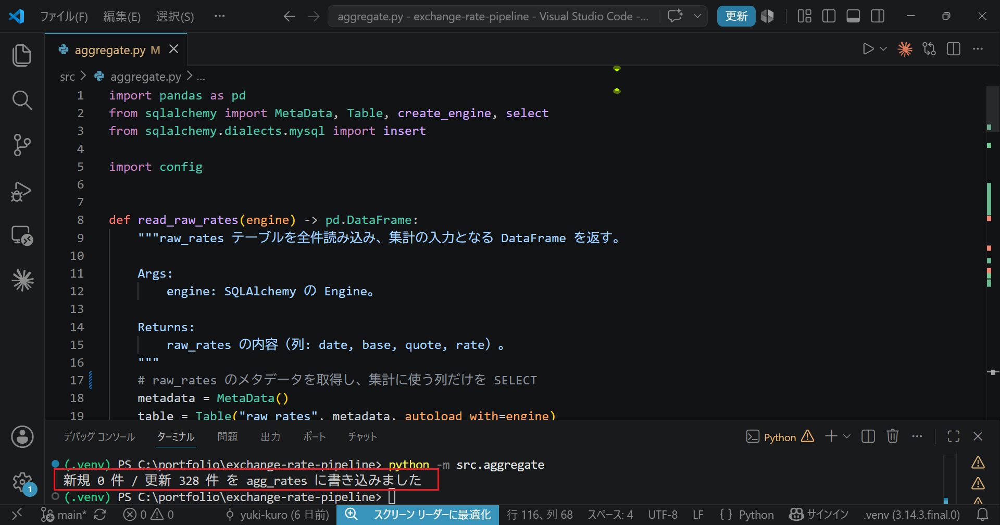
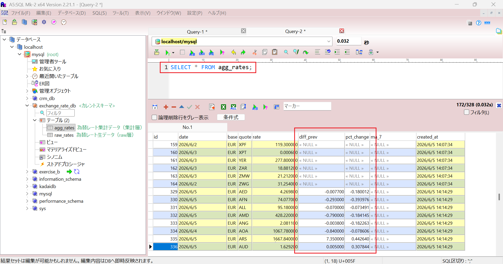

# 為替レートETLパイプライン

データエンジニアリングの実践を目的として開発したポートフォリオです。
公開為替レートAPIから日次でデータを取り込み、MySQL に蓄積・集計するバッチ処理を実装しています。

## 概要

- **Frankfurter API** から為替レートを日次で取得
- pandas で整形し、欠損・異常値を検査する**品質チェック**で不正データを除外
- 生データの **raw 層**と集計結果の**集計層**に分けて MySQL へ蓄積
- **前日比・7日移動平均**を集計し、CSV と PNG グラフで出力
- **冪等な日次バッチ**として実行し、再取り込みしても重複しない

## 処理フローとSTEP分割

```
Extract → Transform → 品質チェック → Load(raw) → 集計 → 出力(CSV/PNG)
```

各STEPで「動く成果物」が残るように分割しています。

1. 基盤整備（構成・requirements）
2. Extract（API取得）
3. Transform + 品質チェック
4. Load（MySQL保存）
5. 集計
6. 出力 + バッチ統合
7. テスト + ドキュメント

## 技術スタック

| 区分 | 採用 | 主な選定理由 |
|---|---|---|
| 言語 | Python | データ処理の定番。requests / pandas 等が充実 |
| 為替レートAPI | Frankfurter API | 無料・APIキー不要・過去データ取得可で ETL バッチに最適 |
| データベース | MySQL | 実務で広く使われ、無料で普及。ポートフォリオに最適 |
| 主要ライブラリ | requests, pandas, SQLAlchemy, PyMySQL, matplotlib, pytest | — |

技術選定の比較・理由の詳細は [設計ドキュメント](docs/design.md) を参照。

## データベース設計

生データ（raw層）を蓄積する `raw_rates` テーブルの構成です。DDL は [sql/schema.sql](sql/schema.sql) を参照。

| カラム | 型 | 制約・説明 |
|---|---|---|
| id | INT | 主キー・連番 |
| date | DATE | レートの日付 |
| base | CHAR(3) | 基準通貨 |
| quote | CHAR(3) | 相手通貨 |
| rate | DECIMAL(18,6) | 為替レート |
| created_at | DATETIME | 取り込み日時 |

- すべて NOT NULL
- `(date, base, quote)` に UNIQUE 制約

### 設計の主なポイント

- **縦持ち**: 1行=1通貨ペアとすることで、通貨が増えても列ではなく行を追加するだけですむ。
- **冪等性（UNIQUE制約）**: UNIQUE制約で冪等性を担保し、INSERT時の重複取り込みを防ぐ。LoadフェーズでUPSERT処理を実装する。
- **DECIMAL の採用**: 金融計算で使われる小数値は、FLOATやDOUBLEだと誤差が出るためDECIMALを採用する。桁数(18,6)は為替レートで使われる標準的な桁数。

### 集計層 `agg_rates`

`raw_rates` から派生させ、前日比・移動平均などの集計値を蓄積する `agg_rates` テーブルの構成です。

| カラム | 型 | 制約・説明 |
|---|---|---|
| id | INT | 主キー・連番 |
| date | DATE | レートの日付 |
| base | CHAR(3) | 基準通貨 |
| quote | CHAR(3) | 相手通貨 |
| rate | DECIMAL(18,6) | その日のレート（raw_rates から複製） |
| diff_prev | DECIMAL(18,6) | 前日比（差）。系列初日は NULL |
| pct_change | DECIMAL(9,6) | 前日比（変化率, %）。系列初日は NULL |
| ma_7 | DECIMAL(18,6) | 7日移動平均。最初の6日は NULL |
| created_at | DATETIME | 算出日時 |

- 指標列（diff_prev / pct_change / ma_7）以外は NOT NULL
- `(date, base, quote)` に UNIQUE 制約

#### 集計層の設計ポイント

- **raw 層との分離**: 生データ（raw）は不変で保持し、加工結果は別テーブルに分ける。集計ロジックを変えて再計算したいとき、raw を壊さず agg_rates だけ作り直せる
- **指標列の NULL 許容**: 系列初日の前日比・最初の6日の移動平均は「まだ計算できない」値のため NULL とする。DEFAULT 0 にすると「変化なし」と区別がつかないため、DEFAULT値は設定しない
- **rate の複製（非正規化）**: 出力工程で join 不要にし、agg_rates 単体でレートと集計値を並べて見られるようにする

## 動作例

### Frankfurter API のレスポンス
ブラウザで `https://api.frankfurter.dev/v2/rates` にアクセスした結果。


### Extract の実行結果（STEP 2）
`extract.py` を実行し、為替レートを JSON配列で取得した結果。


### Transform の実行結果（STEP 3）
`transform.py` を実行し、整形した結果。


### Quality の実行結果（STEP 3）
テストデータで`quality.py` を実行し、クレンジングした結果。


### Load の実行結果（STEP 4）
`load.py` を2回連続で実行した結果。1回目は全件が新規登録、2回目は同じデータのため全件が更新となり、冪等性を確認できる。


実際に `raw_rates` テーブルへ蓄積されたデータ（A5:SQL Mk-2 で `SELECT`）。


### Aggregate の実行結果（STEP 5）
`aggregate.py` を実行し、`raw_rates` から前日比・7日移動平均を計算して `agg_rates` へ保存した結果。再実行すると全件が更新となり、冪等性を確認できる。



実際に `agg_rates` テーブルへ蓄積された集計データ（A5:SQL Mk-2 で `SELECT`）。`diff_prev`（前日比）・`pct_change`（変化率%）が計算されている。`ma_7`（7日移動平均）はデータが7日分たまった時点から計算される（スクショ時点では NULL）。



### パイプライン全体の実行結果（STEP 6）
`main.py` を実行し、Extract→Transform→品質チェック→Load→集計→出力 を一気通貫で実行した結果。各工程の進行と件数がログに出力され、`data/` に集計 CSV とグラフ PNG が出力される。

```
2026-06-16 13:32:54 [INFO] -----パイプライン開始-----
2026-06-16 13:32:54 [INFO] Extract 完了: レート取得
2026-06-16 13:32:54 [INFO] Transform 完了: 164件
2026-06-16 13:32:54 [INFO] 品質チェック 完了: 164件（除外 0件）
2026-06-16 13:32:54 [INFO] Load 完了: 新規0 更新164
2026-06-16 13:32:54 [INFO] 集計 完了: 新規0 更新492
2026-06-16 13:32:54 [INFO] 件数:6, パス:data\agg_rates.csv
2026-06-16 13:32:55 [INFO] パス:data\rates.png
2026-06-16 13:32:55 [INFO] -----パイプライン完了-----
```

## ドキュメント

- [設計ドキュメント (docs/design.md)](docs/design.md) — 背景・技術選定理由・アーキテクチャ・STEP分解
- [開発ログ (Notion)](https://www.notion.so/b421864d51b24570a0ec352cedade572) — 日々の作業記録・設計判断

## セットアップ

```bash
# 1. リポジトリをクローン
git clone <repository-url>
cd exchange-rate-pipeline

# 2. 依存ライブラリをインストール
pip install -r requirements.txt

# 3. 環境変数を設定（.env.example をコピーして MySQL 接続情報を記入）
cp .env.example .env
```

## 実行

### 手動実行
```powershell
.\.venv\Scripts\Activate.ps1
python main.py
```
`main.py` が Extract→Transform→品質チェック→Load→集計→出力 を順に実行し、`data/` に集計 CSV とグラフ PNG を出力します。

### 毎日自動実行（Windows タスクスケジューラ）
venv の Python を作業ディレクトリ固定で呼ぶため、起動用バッチを用意します。

**1. `run_pipeline.bat` をプロジェクト直下に作成**
```bat
@echo off
cd /d C:\portfolio\exchange-rate-pipeline
.\.venv\Scripts\python.exe main.py
```

**2. タスクを登録**（管理者 PowerShell）
```powershell
schtasks /Create /SC DAILY /TN "ExchangeRatePipeline" /TR "C:\portfolio\exchange-rate-pipeline\run_pipeline.bat" /ST 09:00
```

Frankfurter API は平日 16:00 CET 頃に更新されるため、翌朝（例: 09:00 JST）の実行で前営業日の最新レートを取り込めます。UPSERT により再実行しても重複しません（冪等）。
