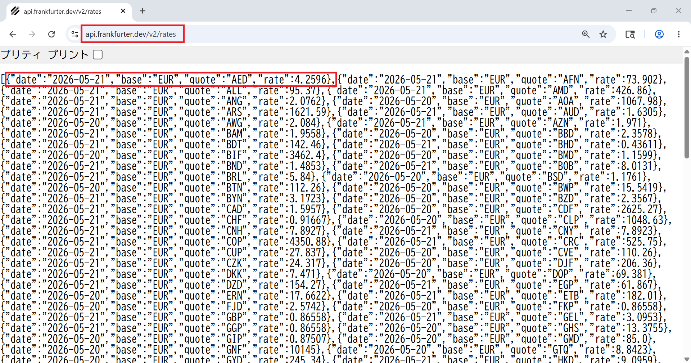
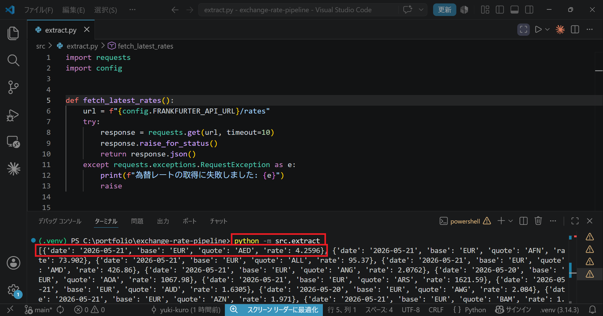
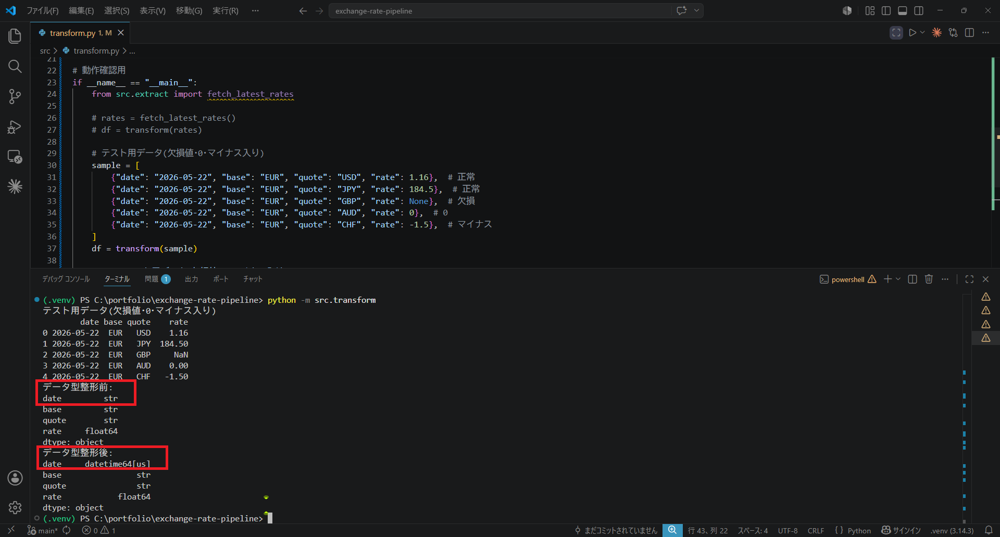
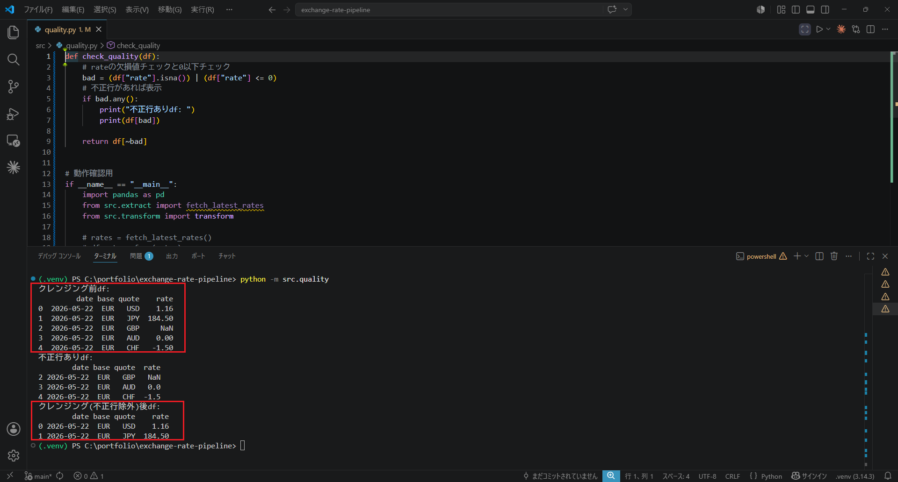
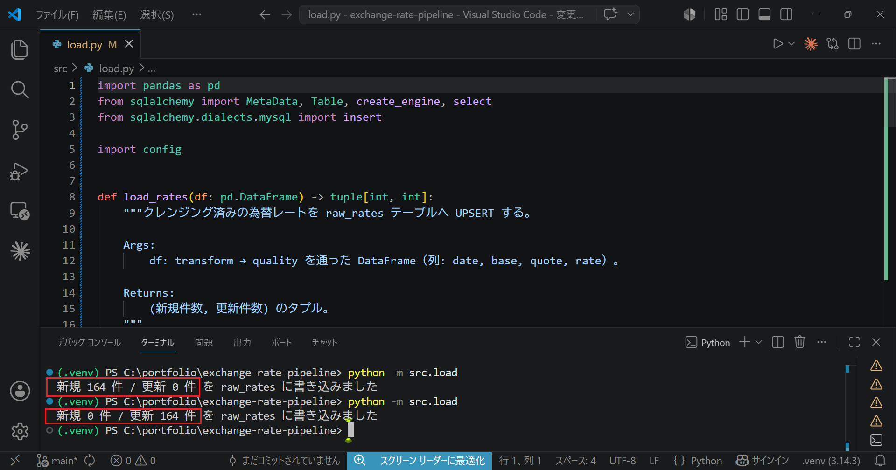
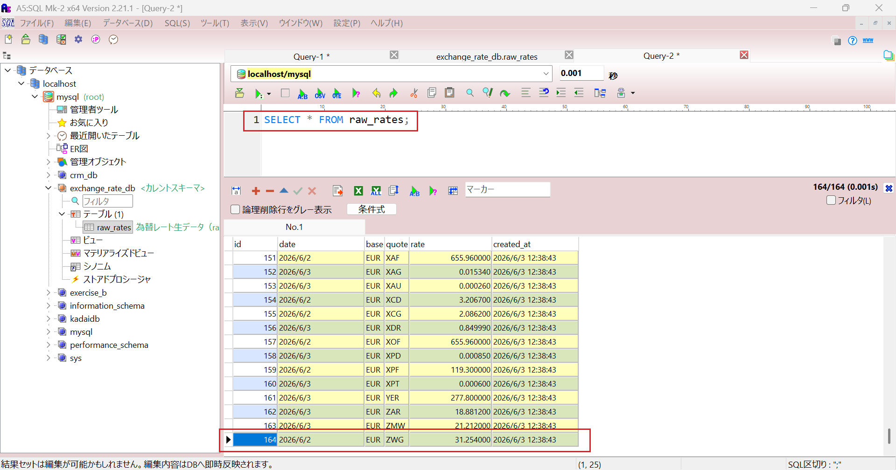

# 為替レートETLパイプライン

公開為替レートAPIから日次でレートを取得し、pandas で整形・クレンジングして MySQL に蓄積・集計する ETL パイプラインです。データエンジニア転向に向けたポートフォリオとして開発しています。

> 🚧 **開発中** — 設計フェーズ完了、実装に着手しています。進捗は下記ロードマップと [Issues](../../issues) を参照してください。

## 概要

- 公開為替レートAPI（Frankfurter API）から為替レートを日次で取得
- pandas で整形・クレンジングし、データ品質チェックを実施
- MySQL に raw データ・集計データを蓄積
- 集計結果を CSV・グラフ（PNG）で出力
- 毎日実行するバッチ処理

## 処理フロー

```
Extract → Transform → 品質チェック → Load(raw) → 集計 → 出力(CSV/PNG)
```

## 技術スタック

| 区分 | 採用 | 主な選定理由 |
|---|---|---|
| 言語 | Python | データ処理の定番。requests / pandas 等が充実 |
| 為替レートAPI | Frankfurter API | 無料・APIキー不要・過去データ取得可で ETL バッチに最適 |
| データベース | MySQL | 実務で広く使われ、無料で普及。ポートフォリオに最適 |
| 主要ライブラリ | requests, pandas, SQLAlchemy, PyMySQL, matplotlib, pytest | — |

技術選定の比較・理由の詳細は [設計ドキュメント](docs/design.md) を参照。

## データベース設計

生データ（raw層）を蓄積する `raw_rates` テーブルの構成です。DDL は [sql/schema.sql](sql/schema.sql) を参照。

| カラム | 型 | 制約・説明 |
|---|---|---|
| id | INT | 主キー・連番 |
| date | DATE | レートの日付 |
| base | CHAR(3) | 基準通貨 |
| quote | CHAR(3) | 相手通貨 |
| rate | DECIMAL(18,6) | 為替レート |
| created_at | DATETIME | 取り込み日時 |

- すべて NOT NULL
- `(date, base, quote)` に UNIQUE 制約

### 設計の主なポイント

- **縦持ち（long format）**: 1行=1通貨ペアとすることで、通貨が増えても列ではなく行を追加するだけですむ。また、生データの構造をほぼそのまま流用できる
- **サロゲートキー**: idを代理キーとして追加した理由は、参照や結合のしやすさと自然キーが変わっても主キーは変わらないため。
- **冪等性（UNIQUE制約）**: UNIQUE制約で冪等性を担保し、INSERT時の重複取り込みを防ぐ。LoadフェーズでUPSERT処理を実装する。
- **DECIMAL の採用**: 金融計算で使われる小数値は、FLOATやDOUBLEだと誤差が出るためDECIMALを採用する。桁数(18,6)は為替レートで使われる標準的な桁数。
- **CHAR(3) の採用**: base/quoteはISO 4217に準拠した通貨コード。3文字固定であることが保証されているため、固定長のCHAR(3)型を採用

## 実装ロードマップ

各STEPで「動く成果物」が残るように分割しています。

| STEP | 内容 | 状況 |
|---|---|---|
| 1 | 基盤整備（構成・requirements） | ✅ 完了 |
| 2 | Extract（API取得） | ✅ 完了 |
| 3 | Transform + 品質チェック | ✅ 完了 |
| 4 | Load（MySQL保存） | ✅ 完了 |
| 5 | 集計 | ⬜ 未着手 |
| 6 | 出力 + バッチ統合 | ⬜ 未着手 |
| 7 | テスト + ドキュメント | ⬜ 未着手 |

## 動作例

### Frankfurter API のレスポンス
ブラウザで `https://api.frankfurter.dev/v2/rates` にアクセスした結果。



### Extract の実行結果（STEP 2）
`extract.py` を実行し、為替レートを JSON配列で取得できたところ。



### Transform の実行結果（STEP 3）
`transform.py` を実行し、整形した結果。



### Quality の実行結果（STEP 3）
テストデータで`quality.py` を実行し、クレンジングした結果。



### Load の実行結果（STEP 4）
`load.py` を2回連続で実行した結果。1回目は全件が新規登録、2回目は同じデータのため全件が更新となり、冪等性を確認できる。



実際に `raw_rates` テーブルへ蓄積されたデータ（A5:SQL Mk-2 で `SELECT`）。



## ドキュメント

- [設計ドキュメント (docs/design.md)](docs/design.md) — 背景・技術選定理由・アーキテクチャ・STEP分解
- [開発ログ (Notion)](https://www.notion.so/b421864d51b24570a0ec352cedade572) — 日々の作業記録・設計判断

## セットアップ

```bash
# 1. リポジトリをクローン
git clone <repository-url>
cd exchange-rate-pipeline

# 2. 依存ライブラリをインストール
pip install -r requirements.txt

# 3. 環境変数を設定（.env.example をコピーして MySQL 接続情報を記入）
cp .env.example .env
```

※ 実行方法は実装の進行に応じて追記します。
